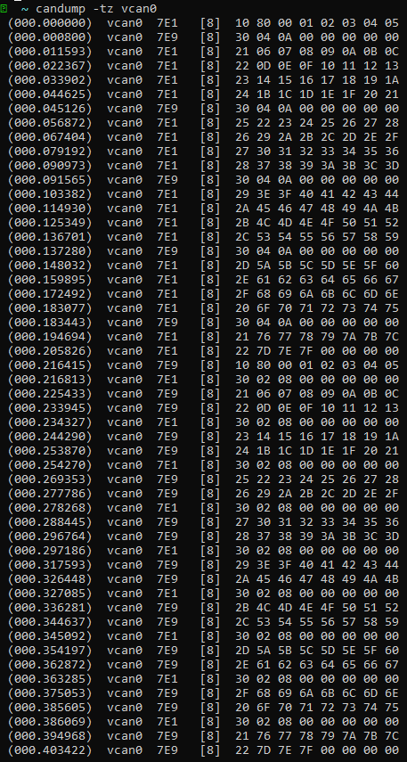

## CAN Communication Practice Based on `python-can` and `can-isotp`

This practice is based on the `python-can` and `can-isotp` libraries, implementing the following two layers of the OSI model:  

1. **Data Link Layer**  
   Implemented basic CAN message transmission and reception using `python-can`, configuring the CAN interface type as `SocketCAN` and handling standard frame format communication.

2. **Transport Layer (TP Layer)**  
   Achieved CAN ISO-TP protocol functionality with the `can-isotp` library, supporting segmentation and reassembly for larger data packet transmissions.

### Highlights
- **Modular Design**: Independently developed data link and transport layer functionalities, ensuring maintainability and scalability.
- **High Compatibility**: Supports common hardware interface types and operates without CAN FD mode.
- **Practical Testing**: Verified reliability and accuracy through real-world use cases.

This practice provides valuable experience for understanding CAN communication protocols and lays a solid foundation for future extensions to application layer protocols.

### Usgae, VCAN is for example

#### Init BUS
 

```
sudo modprobe can vcan
sudo ip link add dev vcan0 type vcan
sudo ip link set up vcan0
```
#### Run server and Clint

if `Client` send 128 bytes to `Server` which also response 128 bytes, test results like this in candump:

```
candum -tz -vcan0
```
 

### Expand

-- CANFD is supported either
-- Vector, PCAN is supported either
 


